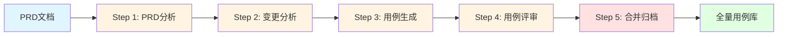

# QA 测试用例工作流插件

<div align="center">

[](https://opensource.org/licenses/MIT)
[](https://github.com/your-repo/qa-testcase-workflow)
[](https://claude.ai/code)
[](https://codebuddy.ai)

测试工程师测试用例管理的完整工作流自动化插件

[功能特性](#功能特性) • [快速开始](#快速开始) • [使用指南](#使用指南) • [示例](#示例) • [文档](#文档)

</div>

---

## 📋 目录

- [项目简介](#项目简介)
- [功能特性](#功能特性)
- [工作流程](#工作流程)
- [安装配置](#安装配置)
- [快速开始](#快速开始)
- [使用指南](#使用指南)
- [命令参考](#命令参考)
- [目录结构](#目录结构)
- [示例](#示例)
- [最佳实践](#最佳实践)
- [故障排查](#故障排查)
- [贡献指南](#贡献指南)
- [许可证](#许可证)

---

## 项目简介

**QA 测试用例工作流插件**是一个为测试工程师设计的完整测试用例管理自动化解决方案，适用于 Claude Code、Cursor、CodeBuddy 等主流 AI Agent 工具。

### 核心价值

- **🚀 效率提升 80%**：从 5 次手动调用减少到 1 次，自动化执行完整流程
- **✅ 降低出错率**：标准化流程避免遗漏步骤，确保质量一致性
- **🔄 断点恢复**：中断后可从上次位置继续，避免重复工作
- **🎯 灵活执行**：支持部分执行、跳步执行、单独调试等多种模式
- **📊 进度可视化**：实时显示执行进度和步骤状态
- **🛡️ 智能容错**：三层错误处理机制，提供 retry/skip/abort 恢复选项

### 适用场景

- 产品需求测试用例设计与管理
- PRD 文档分析与测试关注点提取
- 存量用例变更影响分析
- 自动化测试用例生成
- 测试用例质量评审
- 用例库版本管理与归档

---

## 功能特性

### 🎯 总控工作流（`/qa-workflow`）

一键执行完整的 5 步测试用例管理流程：

```
PRD分析 → 变更分析 → 用例生成 → 用例评审 → 合并归档
```

**核心功能**：
- ✅ 全流程自动化执行
- ✅ 部分执行控制（`--steps`、`--from`、`--only`）
- ✅ 断点恢复（`--resume`）
- ✅ 智能错误处理（retry/skip/abort）
- ✅ 进度实时可视化
- ✅ 状态管理与追踪

### 🔍 独立 Skills（灵活调用）

每个步骤都可以单独调用，满足特殊场景需求：

| Skill | 命令 | 功能描述 |
|-------|------|----------|
| **PRD 分析** | `/qa-prd-analysis` | 分析 PRD 文档，提取功能点、测试关注点和风险项 |
| **变更分析** | `/qa-change-diff` | 分析需求变更对存量用例的影响，生成变更差异报告 |
| **用例生成** | `/qa-testcase-generation` | 基于分析结果自动生成结构化测试用例 |
| **用例评审** | `/qa-testcase-review` | 自动评审用例质量，识别问题并生成评审报告 |
| **合并归档** | `/qa-testcase-merge` | 将新用例合并到全量库，归档当前需求文档 |

---

## 工作流程



### 详细流程说明

#### Step 1: PRD 分析
- **输入**：`prd/current/{需求名}.md`
- **输出**：`prd/current/output/{需求名}-analysis.md`
- **内容**：功能点清单、测试关注点、涉及模块、风险项、术语说明

#### Step 2: 变更分析
- **输入**：分析报告 + 存量用例库
- **输出**：`prd/current/output/{需求名}-change-diff.md`
- **内容**：影响模块分析、需新增/修改/废弃的用例方向

#### Step 3: 用例生成
- **输入**：分析报告 + 变更差异报告
- **输出**：`prd/current/output/test-cases/*.md`
- **内容**：按模块分类的结构化测试用例（含 P0-P3 优先级）

#### Step 4: 用例评审
- **输入**：生成的测试用例
- **输出**：`prd/current/output/test-cases/review-report.md`
- **内容**：用例质量评分、问题清单、修改建议、评审结论

#### Step 5: 合并归档
- **输入**：评审通过的用例 + 全量用例库
- **输出**：更新 `test-cases/`，归档到 `prd/archive/YYYY-MM-DD-{需求名}/`
- **内容**：新增/修改/废弃用例、更新索引、归档 PRD

---

## 安装配置

### 前置要求

- Claude Code ≥ 4.0.0 / Cursor / CodeBuddy
- 项目目录结构符合规范（见[目录结构](#目录结构)）
- Git（可选，用于版本管理）

### 安装方式

#### 方式 1：通过插件市场安装（推荐）

**Claude Code**：
```bash
claude plugin install qa-testcase-workflow
```

**CodeBuddy**：
```bash
codebuddy plugin install qa-testcase-workflow
```

#### 方式 2：手动安装

```bash
# 克隆仓库
git clone https://github.com/your-repo/qa-testcase-workflow.git

# 进入项目目录
cd your-project

# 复制 skills 到项目
cp -r qa-testcase-workflow/skills ./skills
```

### 初始化项目结构

首次使用需要创建必要的目录结构：

```bash
# 自动创建所有必需目录
mkdir -p prd/current/images prd/current/output/test-cases prd/archive test-cases glossary standards

# 创建用例库索引文件
cat > test-cases/index.md << 'EOF'
# 测试用例库索引

## 模块列表
- 待添加...

## 统计信息
- 总模块数：0
- 总用例数：0
- 最近更新：初始化
EOF

# 创建术语表模板
cat > glossary/business-terms.md << 'EOF'
# 业务术语表

## 术语列表
<!-- 添加业务术语定义 -->
EOF
```

或者，在执行工作流时选择自动创建：
```bash
/qa-workflow 退款需求
# 如果目录缺失，会提示选择自动创建
```

---

## 快速开始

### 5 分钟快速上手

1. **放置 PRD 文档**
```bash
# 将 PRD 文档复制到 prd/current/
cp your-prd.md prd/current/退款需求.md

# 如果 PRD 中有图片，一并复制
cp prd-images/* prd/current/images/
```

2. **执行完整工作流**
```bash
/qa-workflow 退款需求
```

3. **查看结果**
```bash
# 分析报告
cat prd/current/output/退款需求-analysis.md

# 变更分析
cat prd/current/output/退款需求-change-diff.md

# 生成的用例
ls prd/current/output/test-cases/

# 评审报告
cat prd/current/output/test-cases/review-report.md

# 全量用例库（已更新）
ls test-cases/
```

---

## 使用指南

### 场景 1：标准完整流程

**适用**：收到新 PRD，需要完整执行从分析到归档的所有步骤

```bash
/qa-workflow 会员订阅需求
```

**预期输出**：
```
🚀 QA 测试用例工作流已启动：会员订阅需求

执行计划：
  → [1/5] PRD 分析
  ○ [2/5] 变更分析
  ○ [3/5] 用例生成
  ○ [4/5] 用例评审
  ○ [5/5] 合并归档

[1/5] 正在执行 PRD 分析...
✓ PRD 分析完成
  - 报告：prd/current/output/member-subscription-analysis.md
  - 功能点：12个
  - 风险项：2个

[2/5] 正在执行变更分析...
...（依次执行所有步骤）

🎉 工作流执行完成！
  - 总耗时：约15分钟
  - 产出用例：45条
  - 全量库总用例数：328条（新增45条）
```

### 场景 2：快速原型（只生成用例草稿）

**适用**：只需要快速生成用例看看覆盖范围，暂不评审和合并

```bash
/qa-workflow --steps 1-3 活动页面改版
```

**效果**：只执行前 3 步（分析、变更、生成），完成后停止

### 场景 3：补充后续步骤

**适用**：之前手动执行了前 3 步，现在想继续评审和合并

```bash
/qa-workflow --from 4 活动页面改版
```

**效果**：从步骤 4 开始执行，前提是步骤 1-3 的产物存在

### 场景 4：错误恢复

**适用**：执行到某步骤时失败，修复问题后继续执行

```bash
# 第一次执行（失败）
/qa-workflow 退款需求
# ... 步骤 3 失败 ...
# 用户选择 [3] abort

# 修复问题后（例如补充术语表）
/qa-workflow --resume

# 输出：
检测到未完成的工作流：退款需求
上次执行到步骤 3 失败，是否继续？
  [1] 从步骤 3 重试
  [2] 跳过步骤 3，继续步骤 4（不推荐）
  [3] 重新开始完整流程
```

### 场景 5：独立调试

**适用**：用例质量不满意，需要单独重新生成

```bash
# 单独重新生成用例
/qa-testcase-generation 退款需求

# 手动修改用例后，继续后续步骤
/qa-workflow --from 4 退款需求
```

---

## 命令参考

### 总控工作流命令

```bash
/qa-workflow [需求名称] [选项]
```

**参数说明**：

| 参数 | 说明 | 示例 |
|------|------|------|
| `需求名称` | 需求的名称（必需） | `退款需求`、`会员订阅` |
| `--steps START-END` | 只执行指定范围的步骤 | `--steps 1-3` |
| `--from START` | 从指定步骤开始执行 | `--from 3` |
| `--only STEP1,STEP2` | 只执行指定的步骤 | `--only 2,4` |
| `--resume` | 从上次中断处继续执行 | `--resume` |
| `--ignore-validation` | 忽略依赖检查（慎用） | `--ignore-validation` |
| `--verbose` | 显示详细日志信息 | `--verbose` |
| `--dry-run` | 模拟执行，不实际调用 | `--dry-run` |

**示例**：

```bash
# 完整流程
/qa-workflow 退款需求

# 只执行前3步
/qa-workflow --steps 1-3 退款需求

# 从步骤3开始
/qa-workflow --from 3 退款需求

# 只执行步骤2和4
/qa-workflow --only 2,4 退款需求

# 断点恢复
/qa-workflow --resume

# 详细日志模式
/qa-workflow --verbose 退款需求
```

### 独立 Skill 命令

```bash
# PRD 分析
/qa-prd-analysis [需求名称或PRD路径]

# 变更分析
/qa-change-diff [需求名称]

# 用例生成
/qa-testcase-generation [需求名称]

# 用例评审
/qa-testcase-review [需求名称]

# 合并归档
/qa-testcase-merge [需求名称]
```

---

## 目录结构

完整的项目目录结构规范：

```
项目根目录/
├── prd/                           # 需求文档目录
│   ├── current/                   # 当前需求目录（✅ 必需）
│   │   ├── {需求名称}.md         # PRD文档
│   │   ├── images/                # PRD引用的图片
│   │   └── output/                # 工作流产物输出目录
│   │       ├── {feature}-analysis.md
│   │       ├── {feature}-change-diff.md
│   │       └── test-cases/
│   └── archive/                   # 归档需求目录（✅ 必需）
│       └── YYYY-MM-DD-{feature}/
│
├── test-cases/                    # 全量测试用例库（✅ 必需）
│   ├── index.md                   # 用例库总索引
│   └── {module}/                  # 模块目录
│       ├── index.md
│       └── {feature}-cases.md
│
├── glossary/                      # 业务术语表（🔶 强烈推荐）
│   ├── business-terms.md
│   └── technical-terms.md
│
├── standards/                     # 测试规范文档（💡 推荐）
│   ├── test-case-template.md
│   └── review-checklist.md
│
└── skills/                        # 工作流Skills定义
    ├── qa-workflow/
    ├── qa-prd-analysis/
    ├── qa-change-diff/
    ├── qa-testcase-generation/
    ├── qa-testcase-review/
    └── qa-testcase-merge/
```

**目录说明**：

| 图标 | 说明 |
|------|------|
| ✅ | 必需目录，缺失会导致工作流失败 |
| 🔶 | 强烈推荐，缺失会影响质量但可继续 |
| 💡 | 推荐目录，可选但有助于规范化 |

---

## 示例

### 示例 1：电商退款需求

**PRD 文档**：`prd/current/refund-feature.md`

**执行命令**：
```bash
/qa-workflow 退款需求
```

**产出**：
- 分析报告：12 个功能点，3 个风险项
- 变更分析：影响 2 个模块（订单、支付），需新增 15 个用例方向
- 生成用例：45 条（P0: 8, P1: 18, P2: 15, P3: 4）
- 评审报告：评审通过，3 个一般问题，5 个优化建议
- 合并归档：新增 42 条，修改 3 条，归档到 `prd/archive/2026-03-17-refund/`

### 示例 2：会员订阅需求（部分执行）

**场景**：只想先生成用例草稿，不进行评审和合并

**执行命令**：
```bash
/qa-workflow --steps 1-3 会员订阅需求
```

**产出**：
- 步骤 1-3 的产物（分析、变更、用例）
- 不执行评审和合并
- 用例草稿位于 `prd/current/output/test-cases/`

### 示例 3：活动页面改版（错误恢复）

**场景**：执行到步骤 3 时因为缺少术语定义失败

**第一次执行**：
```bash
/qa-workflow 活动页面改版
# ... 步骤 3 失败 ...
# 错误：未找到必要的术语定义
# 用户选择 [3] abort
```

**修复问题**：
```bash
# 补充术语表
echo "### 活动页\n- 定义：..." >> glossary/business-terms.md
```

**恢复执行**：
```bash
/qa-workflow --resume
# 检测到未完成的工作流，从步骤 3 重试
# ... 成功完成 ...
```

---

## 最佳实践

### 1. PRD 文档准备

**建议结构**：
```markdown
# 需求名称

## 1. 需求背景
## 2. 需求目标
## 3. 功能描述
   3.1 功能点 1
   3.2 功能点 2
## 4. UI 交互说明
## 5. 接口说明（如有）
## 6. 异常场景
## 7. 验收标准
```

**注意事项**：
- 图片引用使用相对路径：``
- 表格、流程图尽量清晰完整
- 异常场景和边界条件尽量详细

### 2. 术语表维护

**建议格式**：
```markdown
### 订单
- **定义**：用户下单购买商品或服务的记录
- **英文**：Order
- **相关术语**：订单号、订单状态、订单流水
- **使用场景**：订单模块、支付模块、退款模块
```

**维护策略**：
- 每次分析新需求时，补充新术语
- 定期梳理，删除废弃术语
- 跨团队共享，保持一致性

### 3. 工作流执行策略

**推荐流程**：
1. 首次执行用 `--steps 1-3` 快速生成用例草稿
2. 人工审查草稿，调整 PRD 或术语表
3. 重新执行 `--from 1` 完整流程
4. 评审通过后才执行步骤 5 合并归档

**避免的操作**：
- ❌ 不要在 `prd/current/` 同时放多个 PRD 文档
- ❌ 不要手动修改 `prd/current/output/` 下的产物（会被覆盖）
- ❌ 不要跳过步骤 4（评审）直接合并到全量库
- ❌ 不要在工作流执行中手动删除状态文件

### 4. 版本管理建议

**纳入版本控制**：
- ✅ `skills/` 目录（工作流定义）
- ✅ `glossary/` 目录（术语表）
- ✅ `standards/` 目录（规范文档）
- ✅ `test-cases/` 目录（全量用例库）
- ✅ `prd/archive/` 目录（归档需求）

**排除版本控制**（`.gitignore`）：
```
prd/current/.workflow-state.json
prd/current/output/
prd/current/*.md
prd/current/images/
```

---

## 故障排查

### 问题 1：目录结构不完整

**现象**：
```
⚠️  目录结构不完整
以下必需目录不存在：
  ✗ prd/current/
  ✗ test-cases/
```

**解决**：
```bash
# 选项 1：执行工作流时选择自动创建
/qa-workflow 退款需求
# 提示时选择 [1] 自动创建缺失的目录

# 选项 2：手动创建
mkdir -p prd/current/images prd/current/output/test-cases prd/archive test-cases glossary
```

### 问题 2：未找到 PRD 文档

**现象**：
```
✗ 未找到PRD文档
prd/current/ 目录为空，请添加PRD文档。
```

**解决**：
```bash
# 将 PRD 文档复制到 prd/current/
cp your-prd.md prd/current/退款需求.md
```

### 问题 3：状态文件损坏

**现象**：
```
✗ 状态文件损坏，无法解析
```

**解决**：
```bash
# 删除损坏的状态文件，重新执行
rm prd/current/.workflow-state.json
/qa-workflow 退款需求
```

### 问题 4：用例 ID 冲突

**现象**：
```
⚠️  用例ID冲突
步骤5合并时检测到以下ID已存在：
  - TC-ORDER-001
  - TC-ORDER-002
```

**解决**：
1. 检查 `prd/current/output/test-cases/` 中的用例 ID
2. 手动修改为唯一 ID（如 `TC-ORDER-101`）
3. 使用 `--resume` 继续执行

### 问题 5：评审未通过

**现象**：
```
⚠️  评审结论：未通过
存在 5 个致命问题，2 个严重问题
```

**解决**：
1. 查看评审报告：`cat prd/current/output/test-cases/review-report.md`
2. 根据问题清单修改用例文件
3. 重新执行评审：`/qa-testcase-review 退款需求`
4. 确认通过后继续：`/qa-workflow --from 5 退款需求`

---

## 贡献指南

欢迎贡献代码、文档或提出建议！

### 如何贡献

1. **Fork 本仓库**
2. **创建特性分支**：`git checkout -b feature/your-feature`
3. **提交更改**：`git commit -am 'Add some feature'`
4. **推送分支**：`git push origin feature/your-feature`
5. **创建 Pull Request**

### 开发规范

- 所有 Skills 的 `SKILL.md` 必须遵循统一格式
- 新增功能需要补充文档和示例
- 修改核心逻辑需要更新测试用例
- 提交信息遵循 Conventional Commits 规范

### 问题反馈

- 提交 Issue：[GitHub Issues](https://github.com/your-repo/qa-testcase-workflow/issues)
- 加入讨论：[GitHub Discussions](https://github.com/your-repo/qa-testcase-workflow/discussions)

---

## 常见问题（FAQ）

<details>
<summary><strong>Q1: 工作流执行需要多长时间？</strong></summary>

**A**: 根据 PRD 复杂度不同，通常：
- 小型需求（< 5 个功能点）：约 5-10 分钟
- 中型需求（5-15 个功能点）：约 10-20 分钟
- 大型需求（> 15 个功能点）：约 20-40 分钟

可以使用 `--steps 1-3` 先快速生成草稿（约 3-5 分钟）。
</details>

<details>
<summary><strong>Q2: 可以同时处理多个需求吗？</strong></summary>

**A**: 当前版本（v0.1.0）不支持并发执行多个需求。如果检测到正在进行的工作流，会提示先完成或终止。

未来版本将支持多需求并发。
</details>

<details>
<summary><strong>Q3: 生成的用例质量如何保证？</strong></summary>

**A**: 质量保证机制：
1. Step 1 深度分析 PRD，提取功能点和边界条件
2. Step 2 结合存量用例库，避免重复和遗漏
3. Step 3 基于模板和规范生成结构化用例
4. Step 4 自动评审，检查完整性、清晰度、可执行性等
5. Step 5 合并前人工确认，避免误修改全量库

建议：首次使用时先用 `--steps 1-3` 生成草稿，人工审查后再完整执行。
</details>

<details>
<summary><strong>Q4: 如何自定义用例模板和评审规则？</strong></summary>

**A**: 在 `standards/` 目录下维护：
- `test-case-template.md`：自定义用例模板
- `review-checklist.md`：自定义评审规则

工作流会自动加载这些文件作为生成和评审的参考。
</details>

<details>
<summary><strong>Q5: 支持哪些 Agent 工具？</strong></summary>

**A**: 当前支持：
- ✅ Claude Code (≥ 4.0.0)
- ✅ CodeBuddy
- ✅ Cursor

未来计划支持：GitHub Copilot、Tabnine 等。
</details>

---

## 更新日志

详见 [CHANGELOG.md](CHANGELOG.md)

**最新版本：v0.1.0**（2026-03-18）
- ✨ 初始版本发布
- ✅ 完整的 5 步工作流自动化
- ✅ 支持部分执行和断点恢复
- ✅ 智能错误处理机制
- ✅ 进度可视化
- ✅ 状态管理与追踪

---

## 许可证

本项目采用 [MIT License](LICENSE) 开源许可证。

---

## 致谢

感谢所有贡献者和使用者的支持！

- 特别感谢 Claude Code、CodeBuddy、Cursor 团队提供的优秀平台
- 感谢测试工程师社区提供的宝贵反馈

---

<div align="center">

**如有问题或建议，欢迎提交 Issue 或 PR！**

[GitHub 仓库](https://github.com/your-repo/qa-testcase-workflow) • [文档中心](https://docs.example.com/qa-workflow) • [问题反馈](https://github.com/your-repo/qa-testcase-workflow/issues)

</div>
