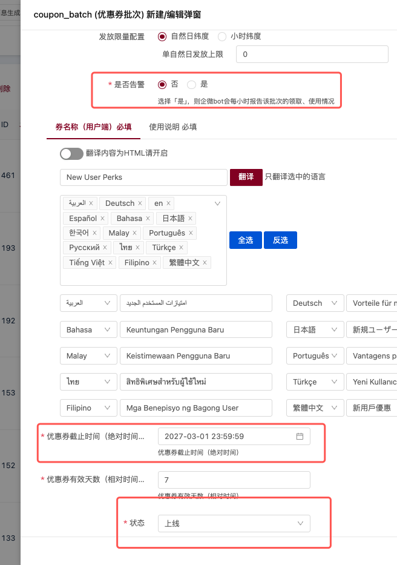
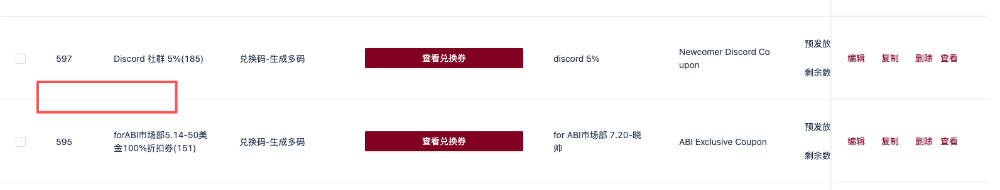
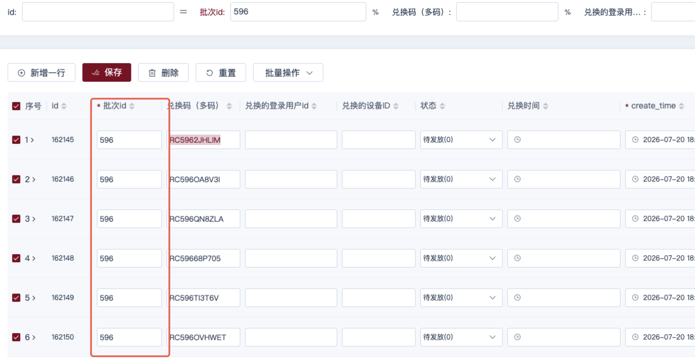

# 【Buff】优惠券系统小细节优化

## 基本信息

- **需求 ID**: 1153211454001615554
- **需求名称**: 【Buff】优惠券系统小细节优化
- **状态**: status_10
- **负责人**: 郑靖轩;金可;
- **优先级**: 2
- **迭代 ID**: 1153211454001010312
- **创建时间**: 2026-07-23 11:29:44
- **最后修改时间**: 2026-08-05 09:51:47

## 需求描述

### 1、「优惠券告警」优化

- **当前表现：**只要告警配置为「是」，不管当前优惠券批次是否=「有效」，都会一直告警。
- **期望：**只要优惠券批次=「无效」or 当前已过优惠券批次截止时间，则该批次不再告警。

### 2、优惠券多码批次删除时，同步删除底表的兑换码

- **当前表现：**将【优惠券-多码】的批次删除时，wuji 底表中，对应批次的兑换码没有同步删除。
- **期望：**将【优惠券-多码】的批次删除时，wuji 底表中，对应批次【还没有被兑换的】兑换码同步删除。
